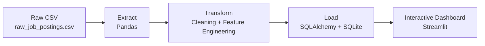

# Job Postings ETL Pipeline


**End-to-end Python ETL pipeline** for real-world job postings data — built as a **Data Engineering / Data Science** portfolio project.

## 📋 Project Overview
This project demonstrates a complete **Extract, Transform, Load (ETL)** pipeline that processes a dataset of **17,880 job postings**. 

It takes messy raw data from a CSV file, cleans it, engineers useful features, and loads the cleaned data into a SQLite database. The pipeline is production-ready with proper logging and robust path handling.

**Business Value**: Produces clean, reliable job data that can power analytics, fraud detection models, job recommendation systems, or enhance a job portal website.

## 🏗️ Architecture


---

## Key Features
- Robust ETL pipeline with logging and error handling
- Data cleaning + feature engineering (`has_salary`, `country`)
- Clean data stored in SQLite database
- **Interactive Streamlit Dashboard** for filtering and visualization
- Professional project structure and documentation

  

##  Technologies Used
- **Python**
-  **Pandas**
-  **SQLAlchemy**
-  **SQLite**
-  **Streamlit**
-  **Logging**

##  Results
- Raw → Cleaned: 17,880 rows × 20 columns
- New features: `has_salary`, `country`

## How to Run

```bash
# 1. Clone the repo
git clone https://github.com/ReubenDube/job-postings-etl-pipeline.git
cd job-postings-etl-pipeline

# 2. Activate venv
venv\Scripts\activate

# 3. Install dependencies
pip install -r requirements.txt

# 4. Run the ETL pipeline
cd scripts
python etl_pipeline.py

# 5. Launch the Interactive Dashboard
cd ..
streamlit run dashboard.py

```
---

## Dashboard Preview
The dashboard allows users to:

- Filter by country, salary availability, and fraud status
- View key metrics and interactive charts
- Explore the cleaned job postings data

## Project Structure

├── data/                  # raw + job_postings.db <br>
├── scripts/  <br>
│   └── etl_pipeline.py  <br>
├── dashboard.py           # ← Interactive Streamlit Dashboard <br>
├── logs/     <br>
├── requirements.txt  <br>
├── .gitignore  <br>
└── README.md   <br>

## Skills Demonstrated

- End-to-end ETL pipeline development
- Data cleaning & feature engineering
- Relational database integration
- Building interactive data applications with Streamlit
- Clean, documented, production-style code


